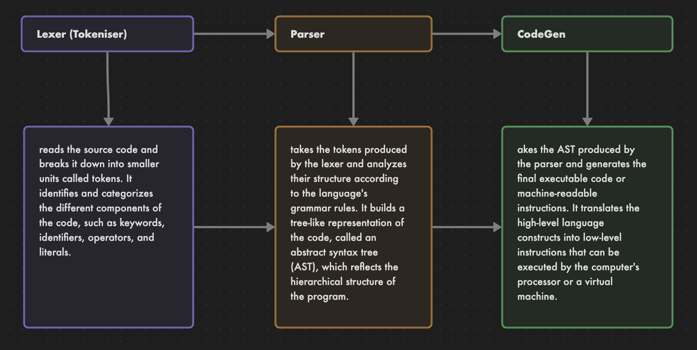
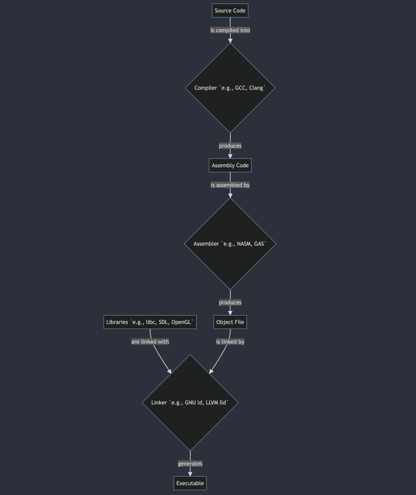

# Unnamed
A language compiler built using C. For learning and fun!

The goal of this language was to compile FizzBuzz entirely, which meant writing to stdout, loops, mod operator, and if statements were required, which were all implemented.

<!-- To see how the syntax looks, checks the examples folder. -->

Quick Start:

Dependencies: gcc, nasm

<!-- ```
./build.sh
./build/unn <filename> <output_filename>
``` -->

# how it works 



# zooming in how it actually works (building the top rhombus/kite 🙂 🪁)




# Compiler Journey

Join me on this wild ride as I attempt to build a compiler from scratch. Here are the steps I've taken so far:

1. [The First Step: The Janky Lexer](assets/journey/step1_janky_lexer.md)
2. [The Second Step: The Janky Lexer](assets/journey/step2_janky_lexer.md)
3. Implemented the Parser..not quiet there yet but on-track.
4. The parser works at least..not easy ngl!!
5. Moving on to the code gen part, but had to first figure out assembly code -> linker to executable so spent couple hours (days) trying many stuff out until it works yay!..moving on now to the code gen..
6. Implemented the code gen basically..currently can fully compile an exit syscall (using arm64 architecture)..
7. Implemented arithmetic operation (addition and subtraction) into the codegen..
8. Update codegen to handle multiple operations all at once..
9. Multiplication working in codegen..
9. ... (more steps to come)