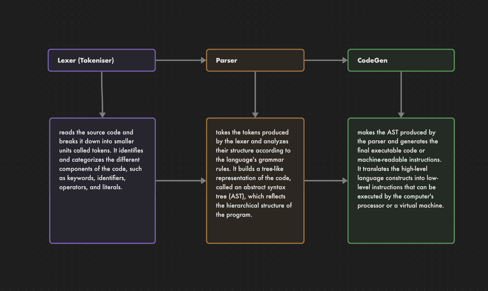

# Unnamed
A language compiler built using C. For learning and fun!

The goal of this language was to compile FizzBuzz entirely, which meant writing to stdout, loops, mod operator, and if statements were required, which were all implemented.

<!-- To see how the syntax looks, checks the examples folder. -->

Quick Start:

Dependencies: gcc, nasm

<!-- ```
./build.sh
./build/unn <filename> <output_filename>
``` -->

# internal 


